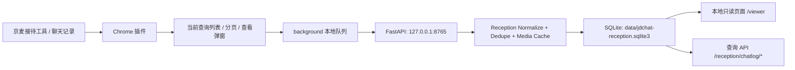

# jdchat

京麦接待工具“聊天记录”采集与本地查询网关。

当前 `main` 分支以新需求为主线：在客服本人已登录京麦后台、页面已打开的前提下，插件进入“聊天记录”列表，按当天默认查询结果逐页点击“查看”，采集弹窗中的客服和客户聊天明细，去重后写入本机 SQLite，并提供本地只读浏览页面和查询接口。

默认数据范围是当前客服可见的当天聊天记录。插件不采集浏览器 cookie/token，不主动请求京东接口，不自动发送消息，不自动标记已读。旧咚咚实时采集逻辑仍保留为 legacy 兼容能力，但默认关闭，不作为当前业务流程。

目标页面：

```text
https://shop.jd.com/jdm/kefu/kf-manage-lite/#/UtilsSetting/ReceptionTools
```

进入页面后点击“聊天记录”卡片。该列表默认就是当天数据，不需要额外筛选日期。

旧主线代码已归档在远端分支：

```text
archive/main-before-reception-chatlog-20260820
```

## 项目架构

```text
jdchat/
├── extension/
│   ├── manifest.json          # Chrome MV3 插件配置
│   ├── injected-main.js       # MAIN world，只读观察页面自然返回的数据
│   ├── content-isolated.js    # 京麦聊天记录列表、分页、“查看”弹窗采集状态机
│   ├── background.js          # 本地队列、批量上传、失败重试、任务进度上报
│   ├── options.html           # 插件弹窗页面
│   └── options.js             # 插件开关、京麦受控采集按钮和参数配置
├── jdchat_gateway/
│   ├── main.py                # FastAPI 入口、路由、鉴权和静态页面
│   ├── settings.py            # JDCHAT_* 环境变量配置
│   ├── db.py                  # SQLite 初始化、迁移和连接
│   ├── reception.py           # 京麦聊天记录规范化、去重、查询和任务进度
│   ├── normalize.py           # conversation/message 规范化和敏感字段脱敏
│   ├── dedupe.py              # dedupe_key、内容哈希和标识哈希
│   ├── repositories.py        # legacy conversations/messages/capture_events 兼容写入
│   ├── media.py               # 图片消息本地缓存
│   └── static/viewer.html     # 本地只读会话浏览页面
├── docs/                      # 架构、插件 MVP 和联调记录
├── tests/                     # 去重、规范化和 API 测试
├── data/                      # 本地 SQLite 与媒体文件，已加入 .gitignore
├── environment.yml            # Conda 环境
└── pyproject.toml             # pytest/ruff 配置
```

数据流：



核心存储表：

- `reception_chatlog_sessions`：京麦聊天记录会话索引，按 `conversation_key` 聚合客户、客服、商品、咨询时间和最新消息。
- `reception_chatlog_messages`：聊天明细消息，使用 `dedupe_key UNIQUE` 幂等入库。
- `reception_chatlog_events`：采集原始事件元数据，用于排查来源和重复。
- `reception_chatlog_capture_jobs`：每日全量补抓和增量巡检任务进度。
- `conversations`、`messages`、`capture_events`：legacy 旧咚咚实时采集兼容表，当前新需求不依赖。
- `audit_logs`：本地操作审计预留表。

## 页面地址

| 类型 | 地址 |
| --- | --- |
| 京麦接待工具页面 | `https://shop.jd.com/jdm/kefu/kf-manage-lite/#/UtilsSetting/ReceptionTools` |
| Chrome 插件管理 | `chrome://extensions` |
| 本地只读浏览页面 | `http://127.0.0.1:8765/viewer` |
| 健康检查 | `http://127.0.0.1:8765/health` |
| 京麦会话列表 API | `http://127.0.0.1:8765/reception/chatlog/sessions` |
| 京麦客户聚合 API | `http://127.0.0.1:8765/reception/chatlog/customers` |
| 京麦最近事件 API | `http://127.0.0.1:8765/reception/chatlog/events/recent` |
| 京麦采集统计 API | `http://127.0.0.1:8765/reception/chatlog/stats` |
| 京麦任务进度 API | `http://127.0.0.1:8765/reception/chatlog/capture-jobs` |
| 本地媒体文件 | `http://127.0.0.1:8765/media/{media_path}` |

本地页面只读取本机网关 API，支持会话搜索、来源筛选、消息查看、图片预览和本机 API token 填写。设置 `JDCHAT_API_TOKEN` 后，除 `/health`、`/viewer` 和本地媒体文件外，查询与采集接口都需要 `Authorization: Bearer <token>`。

## 部署要求

本项目后端开发、运行、启动、测试都必须先激活 Conda 环境：

```bash
eval "$(conda shell.zsh hook)"
conda activate jdchat
```

首次创建环境：

```bash
cd /Users/leo/project/jdchat
conda env create -f environment.yml
```

如果环境已存在，更新依赖：

```bash
cd /Users/leo/project/jdchat
conda env update -f environment.yml --prune
```

校验当前环境：

```bash
python -V
python -m pip list
```

运行要求：

- Python `3.11`
- FastAPI、Uvicorn、Pydantic、pytest、httpx、ruff
- 可写的本地数据目录 `data/`
- Chrome 或 Chromium 浏览器
- 已登录的京麦接待工具页面

## 本机采集网关

启动服务：

```bash
cd /Users/leo/project/jdchat
eval "$(conda shell.zsh hook)"
conda activate jdchat
uvicorn jdchat_gateway.main:app --host 127.0.0.1 --port 8765 --reload
```

启动后访问：

```text
http://127.0.0.1:8765/viewer
```

验证服务：

```bash
curl http://127.0.0.1:8765/health
curl http://127.0.0.1:8765/reception/chatlog/stats
curl "http://127.0.0.1:8765/reception/chatlog/capture-jobs?limit=5"
```

如需后台运行：

```bash
mkdir -p logs
nohup uvicorn jdchat_gateway.main:app --host 127.0.0.1 --port 8765 > logs/gateway.log 2>&1 &
```

## 配置项

默认 SQLite 路径：

```text
data/jdchat-reception.sqlite3
```

可通过环境变量覆盖：

```bash
export JDCHAT_DATABASE_PATH=/absolute/path/to/jdchat-reception.sqlite3
```

可选本机接口 token：

```bash
export JDCHAT_API_TOKEN=local-secret
```

设置后请求需要带：

```text
Authorization: Bearer local-secret
```

如果启用 token，`/viewer` 页面可以填写本机 API token。插件批量上报也需要保证扩展本地配置中的 `apiToken` 与后端一致。

图片消息默认尝试下载到本地媒体目录。下载失败不会拒绝消息入库：

```bash
export JDCHAT_MEDIA_STORAGE_PROVIDER=local
export JDCHAT_MEDIA_DIR=/absolute/path/to/jdchat-media
export JDCHAT_MEDIA_DOWNLOAD_ENABLED=true
export JDCHAT_MEDIA_DOWNLOAD_TIMEOUT_SECONDS=10
export JDCHAT_MEDIA_DOWNLOAD_MAX_BYTES=10485760
```

默认目录为 `data/media`。消息接口会返回 `media_local_path` 和 `media_local_url`。后续切阿里云 OSS 时保留 `JDCHAT_MEDIA_STORAGE_PROVIDER` 和 `JDCHAT_MEDIA_PUBLIC_BASE_URL` 作为配置入口。

## 浏览器插件使用方式

插件位于 `extension/`。使用顺序是先启动本机采集网关，再加载 Chrome 插件，最后在已登录的京麦页面进入“聊天记录”并点击插件弹窗里的“开始采集”。

加载插件：

```text
1. 打开 chrome://extensions
2. 打开 Developer mode
3. 点击 Load unpacked
4. 选择 /Users/leo/project/jdchat/extension
5. 打开 https://shop.jd.com/jdm/kefu/kf-manage-lite/#/UtilsSetting/ReceptionTools
6. 人工登录
7. 点击“聊天记录”卡片
8. 打开插件弹窗，确认“京麦聊天记录采集”开启
9. 点击“开始采集”
```

修改过 `extension/` 代码后，需要回到 `chrome://extensions`，点击 `JDChat Passive Capture` 卡片上的 reload，再刷新京麦页面。只重启本机网关不会让浏览器重新加载插件代码。

插件弹窗入口是浏览器工具栏里的 `JDChat Capture`。弹窗配置会保存到 `chrome.storage.local`：

| 配置 | 默认 | 用途 |
| --- | --- | --- |
| 本机网关 | `http://127.0.0.1:8765` | 插件批量 POST 的本机 FastAPI 地址 |
| 总开关 | 开 | 关闭后只保留插件配置，不再入队上报 |
| 京麦聊天记录采集 | 开 | 当前主流程，读取“查看”弹窗明细并写入独立表 |
| 旧咚咚实时采集 | 关 | legacy 兼容开关，当前新需求不启用 |
| 每日全量补抓 | 开 | 点击“开始采集”后按当天列表全量逐页补抓 |
| 全量页数上限 | `500` | 防止异常分页导致无限采集 |
| 会话上限 | `10000` | 单次全量采集最大记录数 |
| 最长分钟 | `120` | 单次任务最大运行时间 |
| 自动增量巡检 | 开 | 全量完成后定时刷新当天列表并补抓新消息 |
| 刷新间隔分钟 | `3` | 增量巡检周期 |
| 增量巡检页数 | `5` | 每轮增量默认检查前 N 页 |
| 追平确认轮数 | `2` | 增量追平判断参数 |
| Network 被动监听 | 关 | 显式开启后观察页面自然产生的 fetch/XHR/WebSocket 数据 |
| fetch | 开 | 仅在 Network 被动监听开启后生效 |
| XHR | 开 | 仅在 Network 被动监听开启后生效 |
| WebSocket | 关 | 仅在需要验证实时链路时手动开启 |

推荐日常采集配置：

```text
总开关
京麦聊天记录采集
每日全量补抓
自动增量巡检
```

保持以下开关关闭：

```text
旧咚咚实时采集
Network 被动监听
WebSocket 监听
```

点击“开始采集”后默认执行 `backfill_today`：

```text
1. 刷新当前聊天记录查询
2. 回到第 1 页
3. 读取当天总条数和总页数
4. 从第 1 页开始逐页点击“查看”
5. 采集弹窗聊天明细并提交到本机网关
6. 写入 reception_chatlog_* 表，重复消息不新增
```

全量补抓完成后，如果“自动增量巡检”开启，会按配置周期执行 `incremental`：

```text
1. 刷新当前查询结果
2. 回到第 1 页
3. 默认巡检前 5 页
4. 对每条记录重新打开“查看”
5. 数据库按 dedupe_key 去重，只插入新消息
6. 会话 last_message_at 只会向更新消息推进
```

停止采集时点击插件弹窗里的“停止”。停止动作会关闭自动增量巡检，并向当前页面发送停止命令。

旧咚咚实时采集如需临时排查，可打开 legacy 相关开关：

```text
旧咚咚实时采集
DOM 监听
session 快照
Network 被动监听
fetch
XHR
```

该链路不属于当前新需求验收范围。Network 监听只观察页面自然收到的数据，不主动请求京东接口，不保存完整响应体。

常用验证命令：

```bash
curl http://127.0.0.1:8765/health
curl http://127.0.0.1:8765/reception/chatlog/stats
curl "http://127.0.0.1:8765/reception/chatlog/sessions?limit=20"
curl "http://127.0.0.1:8765/reception/chatlog/events/recent?limit=10"
curl "http://127.0.0.1:8765/reception/chatlog/capture-jobs?limit=5"
```

如果 `/health` 正常但没有消息入库，优先检查：

```text
插件是否已 reload
京麦页面是否已刷新
是否已经进入“聊天记录”列表
列表页是否能看到“查看”按钮
插件弹窗总开关是否开启
插件弹窗“京麦聊天记录采集”是否开启
本机网关地址是否仍为 http://127.0.0.1:8765
是否误设置了 JDCHAT_API_TOKEN 导致插件上报 401
```

## 主要接口

当前业务接口：

| 方法 | 路径 | 用途 |
| --- | --- | --- |
| `GET` | `/health` | 健康检查 |
| `GET` | `/viewer` | 本地只读浏览页面 |
| `GET` | `/media/{media_path}` | 本地媒体文件 |
| `POST` | `/reception/chatlog/events` | 接收京麦聊天记录批量事件 |
| `GET` | `/reception/chatlog/stats` | 京麦聊天记录统计和最新任务状态 |
| `GET` | `/reception/chatlog/events/recent` | 最近京麦采集事件 |
| `POST` | `/reception/chatlog/capture-jobs` | 插件上报采集任务进度 |
| `GET` | `/reception/chatlog/capture-jobs` | 查询采集任务进度 |
| `GET` | `/reception/chatlog/sessions` | 会话列表 |
| `GET` | `/reception/chatlog/sessions/{conversation_key}/messages` | 指定会话消息 |
| `GET` | `/reception/chatlog/customers` | 客户聚合列表 |
| `GET` | `/reception/chatlog/customers/{customer_hash}/messages` | 指定客户消息 |

查看数据：

```bash
curl http://127.0.0.1:8765/reception/chatlog/stats
curl "http://127.0.0.1:8765/reception/chatlog/sessions?limit=20"
curl "http://127.0.0.1:8765/reception/chatlog/customers?limit=20"
curl "http://127.0.0.1:8765/reception/chatlog/events/recent?limit=10"
curl "http://127.0.0.1:8765/reception/chatlog/capture-jobs?limit=5"
```

`POST /reception/chatlog/events` 接收插件批量事件，后端会规范化 session/message，计算 `dedupe_key`，并写入 `reception_chatlog_*` 表。去重优先级：

```text
1. reception-chatlog:{cid_hash}:{mid}
2. reception-chatlog:{cid_hash}:{uuid}
3. reception-chatlog:{cid_hash}:{message_at}:{direction}:{body_type}:{content_hash}
```

legacy 兼容接口：

```text
POST /capture/events
GET  /capture/events/recent
GET  /capture/stats
GET  /conversations
GET  /conversations/{conversation_key}/messages
```

这些接口只服务旧咚咚实时采集链路。当前新需求不要依赖这些接口做验收。

## 采集联调流程

最小验证流程：

```text
1. 启动本机采集网关
2. 加载 /Users/leo/project/jdchat/extension
3. 打开并登录京麦接待工具页面
4. 点击“聊天记录”卡片
5. 打开插件弹窗并点击“开始采集”
6. 观察弹窗状态中的总条数、页码、已打开记录数、失败数
7. 查询 /reception/chatlog/stats 验证消息入库
8. 查询 /reception/chatlog/capture-jobs?limit=5 验证任务进度
```

增量验证：

```text
1. 完成当天全量补抓
2. 保持“自动增量巡检”开启
3. 等待下一个刷新周期
4. 如果列表页出现新对话或旧对话有新消息，巡检会重新打开前 N 页“查看”
5. 查询 /reception/chatlog/stats，比对 messages 是否增加
6. 重复采集同一条消息不应增加 messages 数量
```

数据库隔离验证：

```text
1. 默认库路径应为 data/jdchat-reception.sqlite3
2. 当前验收数据看 reception_chatlog_sessions、reception_chatlog_messages、reception_chatlog_events
3. legacy conversations、messages、capture_events 不作为当前业务依据
4. data/jdchat.sqlite3 可作为旧库本地保留或归档
```

## 测试

```bash
cd /Users/leo/project/jdchat
eval "$(conda shell.zsh hook)"
conda activate jdchat
ruff check .
pytest -q
node --check extension/background.js
node --check extension/content-isolated.js
node --check extension/options.js
```

测试覆盖：

- 京麦聊天记录规范化。
- `dedupe_key` 去重和重复提交幂等。
- 会话 `last_message_at` 不被旧消息回退。
- `/reception/chatlog/*` 写入、查询和统计接口。
- 采集任务进度写入和查询。
- legacy `/capture/*` 接口兼容测试。
- `/viewer`、查询接口和 token 鉴权。
- 图片消息本地缓存与 `media_local_url` 返回。

## 安全边界

插件代码不应做以下操作：

```text
复用或上传 cookie/token/aid/sign/access_token
主动 fetch 京东接口
主动创建额外 WebSocket
自动点击发送按钮
写入输入框
调用页面发送、已读、转接或状态变更方法
自动标记已读
自动切换客户
修改查询日期范围
删除本地数据库
```

当前采集只读取“聊天记录”列表和“查看”弹窗中页面自然展示或自然返回的数据。Network 监听只解析页面自然收到的响应/帧，不保存完整响应体，不读取或上报请求头、cookie、token。后续客服 Agent 只能读取本地消息库生成建议回复，不能直接操作京麦页面发送消息。
