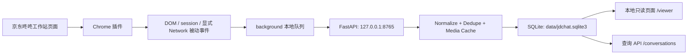

# jdchat

京东咚咚聊天记录被动采集与本地采集网关实验项目。

本项目用于在客服本人已登录京东咚咚工作站、页面自然运行的前提下，被动采集页面已经收到或已经渲染出的聊天消息，写入本机 SQLite，并提供本地只读浏览页面和查询接口。

默认数据范围是当前客服可见的咚咚会话数据。插件不采集浏览器 cookie/token，不主动请求京东接口，不自动切换客户，不自动发送消息，不自动标记已读。

## 项目架构

```text
jdchat/
├── extension/
│   ├── manifest.json          # Chrome MV3 插件配置
│   ├── injected-main.js       # MAIN world，只读观察 window.session 和显式 Network hook
│   ├── content-isolated.js    # isolated world，监听 DOM、页面上下文和历史滚动容器
│   ├── background.js          # 插件本地队列、批量上传、失败重试
│   ├── options.html           # 插件弹窗页面
│   └── options.js             # 插件开关和网关地址配置
├── jdchat_gateway/
│   ├── main.py                # FastAPI 入口、路由、鉴权和静态页面
│   ├── settings.py            # JDCHAT_* 环境变量配置
│   ├── db.py                  # SQLite 初始化、迁移和连接
│   ├── normalize.py           # conversation/message 规范化和敏感字段脱敏
│   ├── dedupe.py              # dedupe_key、内容哈希和标识哈希
│   ├── repositories.py        # conversations/messages/capture_events 查询与写入
│   ├── media.py               # 图片消息本地缓存
│   └── static/viewer.html     # 本地只读会话浏览页面
├── docs/                      # 架构、插件 MVP 和联调记录
├── tests/                     # 去重、规范化和 API 测试
├── data/                      # 本地 SQLite 与媒体文件，已加入 .gitignore
├── environment.yml            # Conda 环境
└── pyproject.toml             # pytest/ruff 配置
```

数据流：



核心存储表：

- `conversations`：会话索引，按 `conversation_key` 聚合客户、商家和最近消息。
- `messages`：规范化消息，使用 `dedupe_key` 幂等写入，保留来源、方向、内容、媒体字段。
- `capture_events`：原始采集事件和页面上下文元数据，便于排查历史咨询采集。
- `audit_logs`：本地操作审计预留表。

## 页面地址

| 类型 | 地址 |
| --- | --- |
| 京东咚咚来源页面 | `https://dongdong.jd.com/` |
| Chrome 插件管理 | `chrome://extensions` |
| 本地只读浏览页面 | `http://127.0.0.1:8765/viewer` |
| 健康检查 | `http://127.0.0.1:8765/health` |
| 会话列表 API | `http://127.0.0.1:8765/conversations` |
| 会话消息 API | `http://127.0.0.1:8765/conversations/{conversation_key}/messages` |
| 最近采集事件 API | `http://127.0.0.1:8765/capture/events/recent` |
| 采集统计 API | `http://127.0.0.1:8765/capture/stats` |
| 本地媒体文件 | `http://127.0.0.1:8765/media/{media_path}` |

本地页面只读取本机网关 API，支持会话搜索、来源筛选、消息查看、图片预览和本机 API token 填写。设置 `JDCHAT_API_TOKEN` 后，除 `/health`、`/viewer` 和本地媒体文件外，查询与采集接口都需要 `Authorization: Bearer <token>`。

## 部署要求

本项目后端开发、运行、启动、测试都必须先激活 Conda 环境：

```bash
eval "$(conda shell.zsh hook)"
conda activate jdchat
```

首次创建环境：

```bash
cd /Users/leo/project/jdchat
conda env create -f environment.yml
```

如果环境已存在，更新依赖：

```bash
cd /Users/leo/project/jdchat
conda env update -f environment.yml --prune
```

校验当前环境：

```bash
python -V
python -m pip list
```

运行要求：

- Python `3.11`
- FastAPI、Uvicorn、Pydantic、pytest、httpx、ruff
- 可写的本地数据目录 `data/`
- Chrome 或 Chromium 浏览器
- 已登录的 `https://dongdong.jd.com/` 页面

## 本机采集网关

启动服务：

```bash
cd /Users/leo/project/jdchat
eval "$(conda shell.zsh hook)"
conda activate jdchat
uvicorn jdchat_gateway.main:app --host 127.0.0.1 --port 8765 --reload
```

启动后访问：

```text
http://127.0.0.1:8765/viewer
```

验证服务：

```bash
curl http://127.0.0.1:8765/health
curl http://127.0.0.1:8765/capture/stats
```

如需后台运行：

```bash
mkdir -p logs
nohup uvicorn jdchat_gateway.main:app --host 127.0.0.1 --port 8765 > logs/gateway.log 2>&1 &
```

## 配置项

默认 SQLite 路径：

```text
data/jdchat.sqlite3
```

可通过环境变量覆盖：

```bash
export JDCHAT_DATABASE_PATH=/absolute/path/to/jdchat.sqlite3
```

可选本机接口 token：

```bash
export JDCHAT_API_TOKEN=local-secret
```

设置后请求需要带：

```text
Authorization: Bearer local-secret
```

如果启用 token，`/viewer` 页面可以填写本机 API token。插件弹窗当前只暴露网关地址和采集开关；MVP 本机联调阶段建议先不设置 `JDCHAT_API_TOKEN`，否则插件批量上报需要额外保证扩展本地配置中的 `apiToken` 与后端一致。

图片消息默认尝试下载到本地媒体目录。下载失败不会拒绝消息入库：

```bash
export JDCHAT_MEDIA_STORAGE_PROVIDER=local
export JDCHAT_MEDIA_DIR=/absolute/path/to/jdchat-media
export JDCHAT_MEDIA_DOWNLOAD_ENABLED=true
export JDCHAT_MEDIA_DOWNLOAD_TIMEOUT_SECONDS=10
export JDCHAT_MEDIA_DOWNLOAD_MAX_BYTES=10485760
```

默认目录为 `data/media`。消息接口会返回 `media_local_path` 和 `media_local_url`。后续切阿里云 OSS 时保留 `JDCHAT_MEDIA_STORAGE_PROVIDER` 和 `JDCHAT_MEDIA_PUBLIC_BASE_URL` 作为配置入口。

## 浏览器插件使用方式

插件位于 `extension/`，是本项目和普通本地后端项目最大的区别。使用顺序是先启动本机采集网关，再加载 Chrome 插件，最后在已登录的咚咚页面中手动打开会话。

加载插件：

```text
1. 打开 chrome://extensions
2. 打开 Developer mode
3. 点击 Load unpacked
4. 选择 /Users/leo/project/jdchat/extension
5. 打开 https://dongdong.jd.com/
6. 人工登录并手动打开一个客户会话
```

修改过 `extension/` 代码后，需要回到 `chrome://extensions`，点击 `JDChat Passive Capture` 卡片上的 reload，再刷新 `https://dongdong.jd.com/` 页面。只重启本机网关不会让浏览器重新加载插件代码。

插件弹窗入口是浏览器工具栏里的 `JDChat Capture`。弹窗配置会保存到 `chrome.storage.local`：

| 配置 | 默认 | 用途 |
| --- | --- | --- |
| 本机网关 | `http://127.0.0.1:8765` | 插件批量 POST 的本机 FastAPI 地址 |
| 总开关 | 开 | 关闭后只保留插件配置，不再入队上报 |
| DOM 监听 | 开 | 读取当前聊天窗口已经渲染出的 `.message` 节点 |
| session 快照 | 开 | 读取页面已有的 `window.session.customer` 和 `window.session.messages()` |
| 历史自动上翻 | 开 | 只滚动当前已打开会话的聊天滚动容器，用于补齐已渲染历史 |
| Network 被动监听 | 关 | 显式开启后观察页面自然产生的 fetch/XHR/WebSocket 数据 |
| fetch | 开 | 仅在 Network 被动监听开启后生效 |
| XHR | 开 | 仅在 Network 被动监听开启后生效 |
| WebSocket | 关 | 仅在需要验证实时链路时手动开启 |

推荐日常采集配置：

```text
总开关
DOM 监听
session 快照
历史自动上翻
```

保持以下开关关闭：

```text
Network 被动监听
WebSocket 监听
```

当前会话采集方式：

```text
1. 确认本机网关 /health 正常
2. 确认插件总开关、DOM 监听、session 快照开启
3. 在咚咚页面手动打开一个客户会话
4. 等待右侧消息渲染
5. 打开 http://127.0.0.1:8765/viewer 或查询 /conversations 验证入库
```

历史咨询采集方式：

```text
1. 由客服手动点击咚咚左侧“历史咨询”
2. 手动打开一个历史会话
3. 插件只读取右侧已经渲染出的消息
4. 历史自动上翻只滚动当前聊天滚动容器，不点击历史会话列表
5. 查询 /capture/events/recent?limit=10 验证 active_sidebar_tab=history
```

如果要启用 Network + DOM 双通道，在插件弹窗中打开：

```text
Network 被动监听
fetch
XHR
```

然后刷新 `https://dongdong.jd.com/` 生效。`WebSocket` 默认关闭；需要验证实时链路时再手动打开并刷新页面。Network 监听只观察页面自然收到的数据，不主动请求京东接口，不保存完整响应体。

常用验证命令：

```bash
curl http://127.0.0.1:8765/health
curl "http://127.0.0.1:8765/conversations?limit=20"
curl "http://127.0.0.1:8765/capture/events/recent?limit=10"
curl http://127.0.0.1:8765/capture/stats
```

如果 `/health` 正常但没有消息入库，优先检查：

```text
插件是否已 reload
咚咚页面是否已刷新
插件弹窗总开关是否开启
本机网关地址是否仍为 http://127.0.0.1:8765
是否误设置了 JDCHAT_API_TOKEN 导致插件上报 401
是否已经手动打开具体客户会话并等待消息渲染
```

## 主要接口

```text
GET  /health
GET  /viewer
GET  /media/{media_path}
POST /capture/events
GET  /capture/events/recent
GET  /capture/stats
GET  /conversations
GET  /conversations/{conversation_key}/messages
```

`POST /capture/events` 接收插件批量事件，后端会规范化 conversation/message，计算 `dedupe_key`，并写入 SQLite。去重优先级：

```text
1. msg.id
2. conversation_key + mid
3. conversation_key + timestamp + direction + body_type + content_hash
```

查看最近会话：

```bash
curl "http://127.0.0.1:8765/conversations?limit=20"
```

按来源筛选：

```bash
curl "http://127.0.0.1:8765/conversations?source=dom"
curl "http://127.0.0.1:8765/conversations?source=session"
```

查看某个会话的消息：

```bash
curl "http://127.0.0.1:8765/conversations/{conversation_key}/messages?order=asc&limit=100"
```

`GET /capture/events/recent` 只返回最近采集事件的元数据，便于验证历史 tab 采集，不返回消息正文：

```bash
curl "http://127.0.0.1:8765/capture/events/recent?limit=10"
```

历史对话验证时重点看：

```text
active_sidebar_tab=history
history_list_visible=true
message_node_count > 0
```

## 采集联调流程

最小验证流程：

```text
1. 启动本机采集网关
2. 加载 /Users/leo/project/jdchat/extension
3. 打开并登录 https://dongdong.jd.com/
4. 手动打开一个当前会话
5. 保持 DOM/session 采集开启
6. 访问 /viewer 或 /conversations 验证消息入库
```

Network + DOM 双通道验证：

```text
1. 点击浏览器插件 JDChat Capture 弹窗
2. 打开 Network 被动监听、fetch、XHR
3. 刷新 https://dongdong.jd.com/
4. 手动打开会话并等待页面自然收发消息
5. 访问 /capture/events/recent 和 /capture/stats 验证来源
```

历史咨询验证：

```text
1. 手动点击咚咚左侧“历史咨询”
2. 手动打开一个历史会话
3. 等待右侧消息渲染和当前聊天滚动容器补齐
4. 查询 /capture/events/recent?limit=10
5. 确认 active_sidebar_tab=history 且 message_node_count > 0
```

## 测试

```bash
cd /Users/leo/project/jdchat
eval "$(conda shell.zsh hook)"
conda activate jdchat
ruff check .
pytest -q
```

测试覆盖：

- `dedupe_key` 优先级和 fallback 去重。
- session、DOM、XHR 等来源的规范化。
- 敏感字段脱敏。
- 事件批量写入、重复合并和来源合并。
- `/viewer`、查询接口和 token 鉴权。
- 图片消息本地缓存与 `media_local_url` 返回。

## 安全边界

插件代码不应做以下操作：

```text
复用或上传 cookie/token/aid/sign/access_token
主动 fetch 京东接口
主动创建额外 WebSocket
自动点击发送按钮
写入输入框
调用 window.session.send / read / setStatus / transfer
自动标记已读
自动切换客户
自动遍历历史会话列表
```

Network 监听只解析页面自然收到的响应/帧，不保存完整响应体，不读取或上报请求头、cookie、token。后续客服 Agent 只能读取本地消息库生成建议回复，不能直接操作咚咚页面发送消息。
